# Hydraulic-System-Control
In this project, we model a hydraulic system and design a controller to stabalize the system. 
 
 
__System Description and Modeling__:
 
 
The system is a single input-single output system. The input is the volumetric flow rate of the hot water going into the system and the output is the temperature of the water in the tank. 
The hot water temperature, cold water flow rate, and temperature are fixed. 
The tank's initial temperature is between cold and hot water. 
Tank and accumulator temperatures are equal and unaffected by accumulator water due to its negligible volume. The specific heat of tank water is constant and matches hot and cold water inputs.
 
 
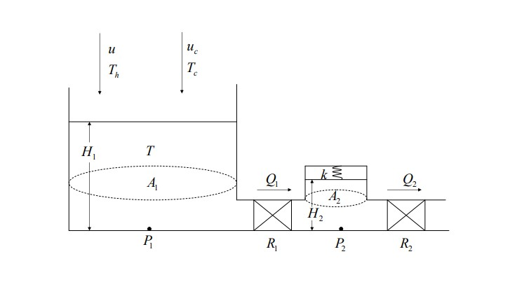
 
 
H1 = Height of the water in the tank
 
H2 = Height of the water in the accumulator
 
P1 = Pressure in the tank
 
P2 = Pressure in the accumulator
 
A1 = Cross sectional area of the tank
 
A2 = Cross sectional area of the accumulator
 
R1 = Fluid resistor between the tank and the accumulator
 
R2 = Fluid resistor between the accumulator and the outside
 
k = Spring constant of the spring in the accumulator
 
u = Input volumetric flow rate of the hot water
 
uc = Input volumetric flow rate of the cold water
 
Q1 = Volumetric flow rate across the first fluid resistor
 
Q2 = Volumetric flow rate across the second fluid resistor
 
Th = Temperature of the input hot water
 
Tc = Temperature of the input cold water
 
T = Temperature of the water in the tank
 
 
__Differential Equations__:
 
Height of the water in the tank:
 
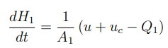
 
 Pressure and the height in the tank:
  
  ρ is the density of the water and g is the acceleration due to gravity
  
 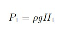
 
 
 Flow rate across the first fluid resistor and the
pressures in the tank and accumulator:
 
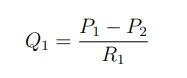
 
 
The height of the
water in the accumulator and the pressure in the accumulator:
 
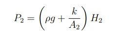
 
The pressure in the accumulator and the flow rate across the second fluid resistor:
 
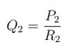
 
 
Using the mentioned equations, we can get:
 
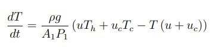
 
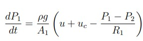
 
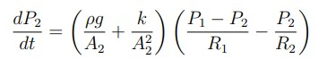
 
 
__State Space__:
 
 
we set T, P1, P2 as the state variables:
 
x1: T,   x2:P1,   x3:P2,  y: output
 
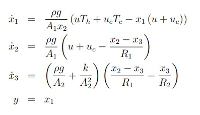
 
Since we have a single input single output system with 1 equilibrium point, we use the equation below to finde the transfer function from the state matrices:
 
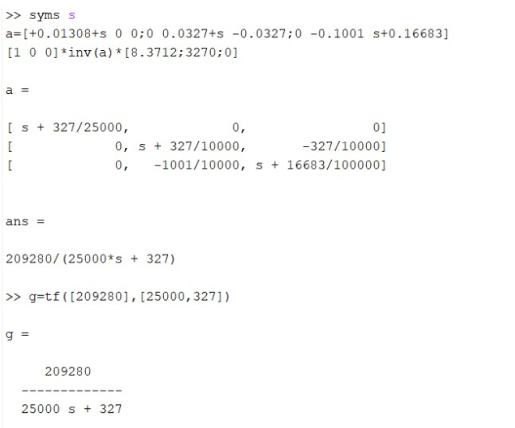
 
Now we plot the RootLocus and Bode diagram of the system:
 
 
Gain Margin: $\infty$,  Phase Margin:96.1,  Band Width:0.013 Hz
 
 
__Controller__:
 
 
We design a lead lag controller:

 
Then we compare the system before and after the conteoller:
 
 
As we can see, the rise and settling time decreased and the system became faster.
 
We plot the Root locus and the bode diagram of the conterolled system:
 
 
Gain Margin: $\infty$,  Phase Margin:135.14,  Band Width:0.173 Hz
 
 
__Distrurbance__:
 
 
input: step function with 0.02 amplitude.
 
System without disturbance:
 
We add a white guassian noise :
 
 
__Non linear Model__:
 
Now we use the original non-linear model of the system to check the performance of the controller:
 
